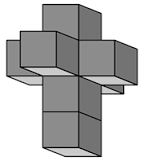

***

## Introdução

Aprendizagem de máquina, também chamada de aprendizagem automática, de acordo com Arthur Samuel em 1959, 
>dota computadores com a habilidade de aprender 
>sem terem sido especificamente programados.
>[Wikipedia, Machine Learning](https://en.wikipedia.org/wiki/Machine_learning)

Andrew NG parece preferir dizer:
>sem terem sido **aparentemente** especificamente programados.
>[Coursera, Machine Learning](https://pt.coursera.org/learn/machine-learning), 
[Andrew NG Homepage](http://www.andrewng.org/)

O entendimento sobre aprendizagem de máquina que desejamos construir aqui é um que seja
capaz de nos ajudar a planejar e executar programas de computador que realizem a tarefa
de aprender a partir de dados disponíveis.

Vamos tentar desenvolver um pouco a ideia por trás da aprendizagem de máquina, que faz
parte da área chamada de inteligência artificial (AI, do inglês, IA).

O estado de um objeto em um dado momento é definido por seus dados. Existem funções capazes
de relacionar objetos e seus dados. Isso nos permite, por exemplo, utilizar uma função que
mapeie um objeto a partir de dados.

Tomemos por exemplo o famoso teorema de Pitágoras, que relaciona os lados de um triângulo
retângulo qualquer:
$$
a^2 = b^2 + c^2
$$
Ao arbitrar dois lados, podemos aplicar a fórmula obtendo o terceiro.
Neste momento teremos definido um triângulo retângulo em um modelo simbólico. Obtivemos um
objeto a partir da aplicação da fórmula em alguns dados. Esta é uma ação típica que somos
capazes de realizar, por exemplo, por ter aprendido a fórmula.

**Quando ensinamos ao computador:**
Podemos construir um código de computador capaz de aplicar o teorema de Pitágoras, operar dados,
e então definir e avaliar as propriedades de triângulos retângulos. Esta abordagem é possível
a partir do fato de que o teorema de Pitágoras é conhecido. Mas, que tal tentar fazer o processo
ao contrário?
A ideia seria a partir de dados, tentar obter a fórmula. Na verdade, foi isto o que Pitágoras
fez. E é a proposta da aprendizagem de máquina.

**Quando o computador aprende:**
Podemos dizer que a ação de um programa de aprendizagem automática é desenvolver novas fórmulas
a partir de dados. Uma abordagem pode ser a de criar uma função que opera de alguma forma em
todos ou parte dos dados disponíveis, de vários objetos de uma mesma classe. Se eles forem
triângulos retângulos, neste caso, criemos uma função que opera em todos os catetos, por exemplo.
Estas operações teriam que ser inicialmente arbitrarias. Afinal, as operações verdadeiras são
desconhecidas.

Num passo seguinte, aplicamos nossa fórmula a dados de catetos. Muito provavelmente esta fórmula
criada ao acaso vai errar ao tentar relacioná-los com suas hipotenusas. Verificamos então o quão
errado a fórmula está, comparado o valor da hipotenusa calculada com o valor da hipotenusa
verdadeira. Desta diferença observada procuramos obter o que chamamos de valor de erro. Este valor
pode ser usado para realizar, aplicando diversas abordagens, oriundas de conhecimento matemático,
um refinamento na fórmula. Em seguida repetimos o processo, tentando obter um erro cada vez menor.
Eventualmente é possível obter uma fórmula exata. E é a isso que chamamos de aprendizagem
automática. Será que Pitágoras poderia ter sido um programa de computador? 

### Tipos de aprendizagem

Normalmente dividimos a aprendizagem automática em três tipos básicos:

* **Supervisionada:** Os dados de entrada possuem uma solução conhecida. Neste caso é possível
verificar a solução aprendida com a solução esperada.

* **Não Supervisionada:** Os dados de entrada não possuem uma solução conhecida. Neste caso é
comum buscar características comuns nos dados dos objetos, e ir agrupando estes objetos em torno
destas características.

* **Com reforço ou aprendizagem profunda:** É quando os dados possuem informações de um ambiente,
aonde uma sequência de ações é possível. Jogos de computador são um exemplo de ambiente.

### Aplicações

Aprendizagem de máquina pode ser aplicada em várias atividades, vejamos alguns exemplos, dentre muitos existentes.

* **Sistemas de recomendação** .
Utilizados por sites de venda, como a Amazon, para recomendar compras
baseadas nas escolhas dos usuários comparados mutuamente. Ou em serviços de _stream_, como o Netflix ou o Prime.
Observem a complexidade de considerar que, ao classificar o filme A como um bom filme, o usuário deverá gostar
também do filme B. Ora, apesar de podermos classificar um filme pelo gênero (ação, romance, etc), a qualidade de
um filme é determinada por fatores muito mais profundos. Pode ser inicialmente devida à música do filme, o estilo
do diretor, os atores, seus desempenhos, o estilo da narrativa. E ainda é preciso agrupar usuários como de
gostos semelhantes, e desta forma poder recomendar um filme que o usuário A gostou para o usuário B.
Em síntese, são muitos fatores a considerar.

* **Carros semi e auto dirigíveis** .
Empresas como o Google, Tesla, Uber, para mencionar algumas, já
estão testando, na prática em em tempo real,  carros semi ou auto dirigíveis, em algumas cidades.
Dirigir é uma atividade complexa, que precisa levar em consideração um grande número de fatores.
Um programa de computador que deseja _aprender_ a dirigir, de maneira semelhante a como uma pessoa aprende,
deve ser capaz de levar em consideração a observação visual da estrada, deve prever as ações de outros motoristas,
deve observar a sinalização, deve considerar informações sonoras. A lista de fatores que influenciam cada ação
de acelerar, reduzir, parar, controlar o volante, etc, é extensa. Imagine se tivéssemos que ensinar uma pessoa a
dirigir, e que esta pessoa nunca andou de carro, nem mesmo sabe o que é um carro. E se tivéssemos que ensinar 
dentro de uma sala, sem prática real, sem imagens, apenas ensinando a teoria, descrevendo o que pode acontecer,
o que deve ser feito diante de cada evento ... Seria uma tarefa beirando a impossibilidade.
Em termos de computação, isto seria programar uma máquina especificamente para a realizar uma tarefa determinada.
Por outro lado, na vida real, as pessoas aprendem a dirigir inicialmente observando alguma outra pessoa dirigir.
Depois, começam a praticar, em geral em um algum local especialmente seguro, uma estrada com pouco movimento.
Cometem erros, e aprendem com estes erros. O equivalente disto para um programa de computador poderia ser aprender
observando filmes de alguém dirigindo, e depois simular o ato de dirigir começando dentro de um ambiente virtual,
até conseguir igualar, e até mesmo ter desempenho melhor do que os motoristas observados.
Isto seria um programa aprendendo algo sem ter sido especificamente, exatamente instruído sobre o que fazer.

* **Diagnóstico de enfermidades, como o câncer** .
Muitas doenças graves, se diagnosticadas a tempo,
podem ser tratadas com mais eficiência, evitando danos mais graves e óbitos precoces. Recentemente uma série
de televisão chamada **House** fez bastante sucesso. Mostrava as atividades de uma equipe especializada em
diagnóstico de um grande hospital. O foco da série era a grande dificuldade de diagnosticar certas patologias.
Isso exige grande capacidade do especialista. Por mais que estude, pelas limitações humanas, um médico não consegue
aprender tudo que seria bom saber. Um programa de computador capaz de aprender, na presença de dados históricos,
pode atingir níveis de conhecimentos sem precedentes. Programas de aprendizagem automática têm frequentemente
ultrapassado a eficiência de pessoas em várias situações e abordagens.

* **Detecção de atividades fraudulentas na Internet** .
Sites de serviços, como bancos, sites de venda,
são muito visados por fraudadores. Programas que podem aprender a identificar ações fraudulentas possuem grande demanda.

* **Jogos** .
Programas de aprendizagem automática têm apresentado resultados expressivos aprendendo
jogos, como xadrez e go. São utilizados com grande sucesso em jogos desenvolvidos para computadores, onde a
informação deve ser obtida através de imagens e dados do ambiente virtual.
Jogos exigem uma forma de aprendizagem especial, diferente de, por exemplo, aprender a classificar objetos
a partir de suas imagens, e aonde só existe uma classificação correta, as demais estariam erradas.
Em um jogo existe o cenário e um conjunto de ações disponíveis, executáveis através de dispositivos como
o mouse ou teclado. O jogador, seja pessoa ou máquina, tem um objetivo: ganhar o jogo!
O problema é que quase nunca existe apenas uma ação correta. O jogador pode ir em frente, virar a esquerda,
virar a direita ... e isso não faz diferença imediata. Só após executar um numero nem sempre pequeno de ações,
as consequências começam a aparecer. Para aprender a jogar, um programa tem que ser capaz de experimentar
e avaliar o resultado de longas tomadas de decisão.

## Aprendizagem de máquina, uma nova fronteira

Podemos dizer que a aprendizagem de máquina se situa na fronteira da computação e da estatística.
A estatística é um ramo da matemática especializada em coletar, observar, classificar e determinar ações através
da análise de dados. Utiliza bastante os conhecimentos de probabilidade para isso.

Aprender por observação demanda quantidades muito grandes de dados históricos, que possam _mostrar_ claramente
o que deve ser feito, com exemplos tanto de sucessos, como de fracassos.

Uma observação aqui, com relação a graduação de engenharia da computação, é que naturalmente são cursos que estudam
computação e estatística, e se dedicam bastante ao estudo da matemática. São portanto alunos que naturalmente
adquirem uma base adequada, incluindo a habilidade de programar computadores, para estudar aprendizagem automática.

## Anatomia da aprendizagem

Vejamos o exemplo de uma criança pequena aprendendo. Alguém aponta um objeto para ela e diz algo como:
"Olhe, um au-au!", ou então, - "Ali, um carro!", e assim por diante. Algum tempo depois, a criança começa a
mencionar o nome destes objetos quando os vê. A criança aprendeu o nome dos objetos e é capaz de classificá-los com
sucesso até certo ponto.

Alguns aspectos do processo de aprendizagem podem ser destacados:

* **Mostrar e rotular**. Alguém apenas precisa mostrar e rotular (informar o nome) do objeto.
* **Sem destaque para as características**.  Não é necessário ensinar quais as características do objeto que devem ser
utilizadas na classificação. E mesmo assim funciona. Não se tenta explicar a uma criança pequena o que é um carro,
como ele funciona, o que é o motor, combustível, dizer que tem rodas, como funcionam as rodas ... ela ainda não está
preparada para adquirir estes conceitos. Espera-se que ela aprenda apenas vendo e ouvindo o nome.
* **Aprendizagem capaz de ser generalizada**. A criança consegue, aprendendo a classificar os objetos apontados,
a classificar também novos objetos do mesmo tipo mas que não tinham sido avistados antes.

## Podem computadores classificar objetos a partir da observação de imagens, como as pessoas fazem?

Código de computador são conjuntos de instruções. As instruções são estritas e simples, são operações matemáticas
aplicadas a dados numéricos. Por exemplo, - "some isto e armazene ali", - "compare estes e decida o que fazer
baseado no resultado", - "repita estas operações até que ...", e assim por diante. Não é uma tarefa difícil ensinar
uma criança a reconhecer um carro, é só apontar e dar o nome. Mas talvez não seja tão fácil ensinar um computador
a fazer o mesmo através de instruções específicas de computador. Estes aspectos serão aprofundados e discutidos
na evolução deste texto. Mas por ora, podemos considerar a dificuldade que teríamos de expressar as propriedades
(ou características) dos componentes de um carro que permitissem seu correto reconhecimento e classificação:
Tem que ter esta cor, tem que ter esta forma, etc, e ao dizermos isto para alguém que nunca viu um carro,
a pessoa chega a conclusão que um carro é na verdade um besouro!
Se apenas pensarmos sobre isso veremos que não é uma tarefa fácil.
Porque talvez possamos dizer que somos capazes de reconhecer um carro, mas não sabemos bem descrever como o fazemos.
Uma das razões pode ser especulada diante de resultados de algumas pesquisas de ponta sobe o funcionamento do
cérebro humano. Existem pesquisas afirmam que nossos cérebros não processam informações como uma série única e linear
de operações. Ao invés disto, utilizam várias áreas de processamento separadas, com algumas destas áreas sendo
bem especializadas em fazer determinados tipos de operações, diferentes de outras.
E mais, estas operações ocorrem de forma concorrente, e ainda, ocorrem tanto em áreas conscientes como em áreas
inconscientes de nosso cérebro. Como resultado disto, podemos estar conscientemente tentando falar o nome do objeto
que avistamos, e de repente, no meio deste pensamento surge do nada a palavra carro, sem termos consciência do que
aconteceu para chegarmos a esta conclusão. E tudo isto é tão rápido, que logo em seguida, sem refletir, já estamos
pensando em outra coisa. Podemos resumir isso como: Sabemos fazer, mas não sabemos como fazemos!

Cientistas da computação utilizam várias abordagens para realizar reconhecimento de objetos, no campo mais geral
da inteligência artificial. Houve algum sucesso na utilização de segmentação de um objeto em suas características
(propriedades), mas com pouco efeito generalizado. É é que o aprendizado automático tem recebido esforços
de desenvolvimento, e tem apresentado alguns resultados promissores. Vamos aprender que um algoritmo de reconhecimento
realiza seu trabalho selecionando algumas características. A partir delas, criam novas características, como uma
nova geração, evoluída, com novos indivíduos, mais fortes, que herdam das características da geração anterior.
Neste momento, não temos mais ideia exata de quais são as características selecionadas.
Provavelmente, um grande número, e também, uma grande combinação delas.
Não necessariamente algo evidente como rodas, cantos e para-brisas.

## Separar para classificar

Para classificar, reconhecer objetos, precisamos ser capazes de compará-los, e isto equivale a separá-los.
Pegue por exemplo duas cidades. Você separa o que pertence a uma cidade do que pertence a outra desenhando um
mapa das cidades onde existe uma linha fronteiriça entre elas.
Que sejam Vassouras e Barra do Piraí.
Desta forma, as pessoas que moram de um lado da fronteira pertencem a Vassouras e as que moram do outro
pertencem a Barra do Piraí. O problema é que, mesmo em duas dimensões, desenhar fronteira pode ser complicado.
Dificilmente vai ser uma linha reta. Mais provavelmente vai ser uma linha bastante irregular, seguindo preferencialmente
detalhes de fenômenos geográficos, como rios, montanhas. E ainda, fenômenos artificias, como casas,
ruas, estradas e propriedades rurais. Mas vamos começar a pensar sobre separação da forma mais simples possível.

### uma dimensão.

Em uma dimensão só existe o ponto.

### duas dimensões.

Em duas dimensões passamos a ter o plano.
Podemos colocar dois pontos sobre um plano e estabelecer suas posição com coordenadas cartesianas.
Em seguida, podemos definir uma linha reta, novamente com coordenadas cartesianas, de tal forma que ela separe os
dois pontos. Algo como: Deste lado está o ponto **A**, e deste outro está o ponto **B**.

Vamos ilustrar um pouco melhor a separação de pontos com uma linha reta.
Imagine um gráfico cartesiano (em azul), como na Figura 1.
Imagine a ocorrência de dois grupos de valores, os pontos verdes e os vermelhos.

Então, você traça uma linha preta para separar os dois grupos de valores, como na Figura 2.

É preciso girar o sentido da linha separadora para uma posição mais adequada, veja a Figura 3.

Você vê que apenas girar não é suficiente para a melhor separação.
Deslocar a linha separadora permite melhor resultado, como mostra a Figura 4.

| Figura 1 | Figura 2 | Figura 3 | Figura 4 |
| :---:    | :---:    | :---:    | :---:    |
|  |  |  |  |

Para posicionar a reta convenientemente separando os pontos de cores diferentes, precisamos em
primeiro lugar definir uma equação de uma reta no plano cartesiano.

A equação geral da reta: **ax + by + c = 0**.

Se você escolher originalmente uma reta que fica exatamente sobre um dos eixos cartesianos, para deslocá-la de forma que
separe os pontos de cores diferentes, você deseja fazer dois tipos de operação geométrica, rotação e translação. Rotação,
com diz o nome, faz a reta rodar mudando de ângulo com relação aos eixos cartesianos **X** e **Y**. Alterar os valores
das constantes **a** e **b** na equação geral da reta causa rotação.
Mas só mudando a rotação, a reta sempre passa sempre pela origem, ou seja, pelos pontos **x=0** e **y=0**.
Para transladar a reta, alteramos a constante **c**. Se **c** é diferente de zero, a reta não passa pela origem.

Continuemos pensando. Se os objetos estão em dois grupamentos distintos, uma reta pode separá-los.
A medida em que se misturarem, podemos precisar de uma linha curva. Na verdade, a reta pode ser considerada
como um caso especial de uma curva, no sentido que poderíamos definir uma reta com a equação da curva.

Outra possibilidade é traçar retas e curvas para separar três ou mais tipos de objetos. Vamos usar o termo linhas.
Dadas linhas suficientes, podemos separar qualquer quantidade de objetos diferentes num plano.

### três dimensões

Linhas não são suficientes para separar objetos em três dimensões. Para prosseguir com este pensamento, vamos propor
utilizar sacos. Só que não podemos pegar os objetos e simplesmente colocar em sacos diferentes, um para cada tipo de objeto.
Ao fazer isso, estaríamos mudando a posição dos objetos. O que queremos é mudar a posição dos sacos. Vamos então imaginar
um saco muito especial: tem que ser flexível, de forma que possamos ir esticando e fazendo a boca dele envolver cada objeto 
do tipo que ele separa, quando a boca do saco passar por todos os objetos, damos um nó fechando-a. Com sacos suficientes,
podemos separar qualquer quantidade de objetos em um espaço de três dimensões. Mas, qual o material para este tipo de saco?
Afinal, quanto mais tipos de objetos e quão mais espalhados eles tiverem, mais flexível o saco precisa ser para podermos
realizar a tarefa, temos que ir esticando, esticando. Poderia ser látex? Bom, látex é flexível, mas tem limites. Se esticar
demais, pode rasgar. Como só estamos imaginando, vamos então imaginar um novo tipo de material: espacex, feito de espaço, de
tecido temporal. Esticando nossos sacos de espacex tranquilamente poderíamos separar todos os objetos. Mesmo se forem os
planetas e as estrelas. E as equações? Sim, é possível perfeitamente definir uma equação com três dimensões para o saco de
espacex que permita verificar, dadas as coordenadas espaciais em três dimensões de um objeto, em qual saco ele está. É só uma
operação geométrica. Claro que pode ficar muito complexa, mas pode perfeitamente ser calculado.

### quatro dimensões

Agora que começa a ficar interessante. Nós vemos o mundo em três dimensões, pelo menos aparentemente.
Para preparar a imaginação, seria bastante útil ler o livro
[Flatland: A Romance of Many Dimensions by Edwin Abbott Abbott](http://www.gutenberg.org/ebooks/97).
(Estamos informando o link em inglês no [Project Gutenberg](http://www.gutenberg.org/) que é um site onde podemos encontrar
livros que caíram no domínio público, sem restrições e sem custo. Os livros são oferecidos em muitos formatos, como texto, html,
para leitores como kindle ou epub. Existem às vezes traduções para outros idiomas. é só verificar).

Em uma ocasião o matemático Riemann, discípulo de Gauss, considerado um dos maiores matemáticos de todos os tempos, demonstrou em
um artigo o cálculo da diagonal do cubo com quatro dimensões, denominado de tesseract.

Na verdade, podemos com cálculos geométricos calcular e verificar em quais sacos de espacex se encontram objetos definidos em quatro
dimensões. Apenas o cálculo é bem mais complexo que o cálculo com três dimensões. Porém, só o que aumenta é o número de operações
necessárias, daí a complexidade. As operações em si são basicamente as mesmas.

### múltiplas dimensões

Finalizando o exercício de imaginação, o cálculo pode ser feito para sacos de espacex em quantas dimensões desejarmos.
Na verdade, a verdadeira dificuldade com que precisamos lidar para realizar a separação de dados perfeita, em múltiplas dimensões
(considere que as informações que podemos obter sobre, por exemplo, um filme, como gênero, subgêneros, atores, opiniões, crítica, duração,
ano em que foi feito, prêmios, etc, cada uma é uma dimensão), a verdadeira dificuldade é a quantidade de operações que temos que realizar.

Os computadores evoluíram e evoluem em sua capacidade de realizar grandes quantidades de cálculos.
Discutiremos a seguir como a evolução dos computadores impacta a capacidade de maior aprendizagem dos programas de aprendizagem automática.
